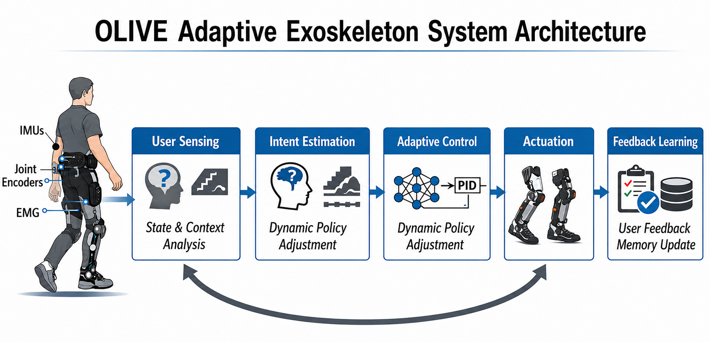

# OLIVE: Online Low-Rank Incremental Learning for Efficient Adaptive Exoskeletons

Parameter-efficient online adaptation for wearable hip exoskeletons. A frozen
base controller `W0` (`BaseController`) is distilled from Physical Intelligence’s
open-world VLA **π₀.₅**, then personalised online via a gated low-rank residual
`ΔW_t = A_t B_tᵀ` with dynamic rank scheduling — all from on-body sensor
rewards (EMG, IMU, vibration), no reference trajectories.

· Paper: [OLIVE](https://arxiv.org/abs/2606.05234): Online Low-Rank Incremental Learning for Efficient Adaptive Exoskeletons (*UbiComp ’26*)
<!-- · Code: [FastLM/OLIVE](https://github.com/FastLM/OLIVE) -->

<p align="center">
  
</p>

## Repository layout

```
OLIVE/
├── README.md
├── CMakeLists.txt / Makefile
├── .gitmodules
│
├── include/olive/                 
│   ├── config.hpp                 #   dims, ranks, reward / loss weights
│   ├── matrix.hpp                 #   Eigen helpers
│   ├── sensor.hpp                 #   IMU / joint / EMG / vibration → s_t
│   ├── intent.hpp                 #   walk / climb / slope / uneven
│   ├── model.hpp                  #   W0 + gated low-rank ΔW_t = A_t B_tᵀ
│   ├── reward.hpp                 #   shaped reward r_t
│   └── trainer.hpp                #   online PG update on A_t, B_t
│
├── src/                           
│   ├── main.cpp                   #   100 Hz control loop
│   ├── model.cpp / reward.cpp / trainer.cpp / sensor.cpp / intent.cpp
│
├── distillation/                  # π₀.₅ / π₀.₆ → BaseController (frozen W0)
│   ├── student.py                 #   BaseController + GateRankNet
│   ├── losses.py                  #   L_KD + λ_feat L_feat
│   ├── teacher.py                 #   openpi adapter + hip-torque projector
│   ├── dataset.py                 #   distillation set builders
│   ├── export_w0.py               #   binary export → load_base_weights
│   ├── train.py                   #   CLI: python -m distillation.train
│   └── test_distill.py
│
├── teachers/                      
│   ├── pi0.5/  →  Physical-Intelligence/openpi   (π₀.₅ teacher)
│   └── pi0.6/  →  Physical-Intelligence/openpi   (π₀.₆ upstream)
│
├── configs/
│   ├── distill_pi05.yaml
│   ├── distill_pi06.yaml
│   └── olive_deploy.yaml
│
├── scripts/eval.cpp               # ablation / terrain eval
├── tests/test_olive.cpp           # C++ unit tests
├── assets/                        # pipeline + design figures
└── third_party/eigen/             # matrix backend
```

## Build

```bash
make            # olive_deploy, olive_eval, olive_tests
make test
./olive_deploy checkpoints/base_controller_w0.bin
```

Or CMake:

```bash
cmake -B build && cmake --build build -j
```

## Distill W₀ from π₀.₅ / π₀.₆

```bash
pip install -r distillation/requirements.txt

# Smoke test
python -m distillation.train --teacher pi0.5 --synthetic --steps 200 \
    --export checkpoints/base_controller_w0.bin

# get teacher model
git submodule update --init --depth 1 teachers/pi0.5
python -m distillation.train --teacher pi0.5 \
    --checkpoint gs://openpi-assets/checkpoints/pi05_base \
    --export checkpoints/base_controller_w0.bin
```

See [`distillation/README.md`](distillation/README.md) and
[`teachers/README.md`](teachers/README.md).

| Component | Code |
|-----------|------|
| π₀.₅ / π₀.₆ → BaseController distillation | `distillation/` |
| Low-rank `Θ_t = W0 + A_t B_tᵀ` | `include/olive/model.hpp` |
| Gated personalisation `α_t` | `GateRankNet` |
| Dynamic rank `r_t ∈ {4…16}` | `OLIVEModel::select_rank` |
| Reward-shaped PG update | `reward.hpp`, `trainer.hpp` |
| Online control loop | `src/main.cpp` |

## Citation

```bibtex
@inproceedings{liu2026olive,
  title     = {{OLIVE}: Online Low-Rank Incremental Learning for Efficient Adaptive Exoskeletons},
  author    = {Liu, Dong and Yu, Yanxuan and Lengerich, Ben and Geng, Tong and Wu, Ying Nian},
  booktitle = {2026 ACM International Joint Conference on Pervasive and Ubiquitous Computing},
  year      = {2026}
}
```

## Acknowledgements

Teacher VLAs: [Physical Intelligence openpi](https://github.com/Physical-Intelligence/openpi)
(π₀ / π₀-FAST / π₀.₅). π₀.₆ model card:
[link](https://website.pi-asset.com/pi06star/PI06_model_card.pdf).
