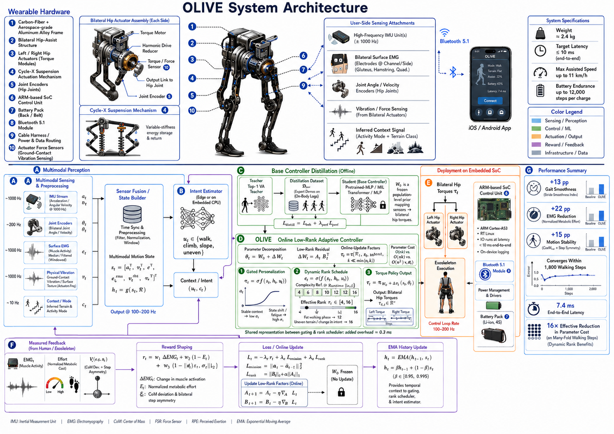

# OLIVE Distillation Module
# π0.5 / π0.6 → BaseController (frozen W0)

Offline distillation stage. A full VLA such as π0.5 cannot run on the wearable
SoC; we distill it into the compact `BaseController` used online:

```
L_KD      = E[ ‖π_W0(s) − a_T‖² + β KL(π_T ‖ π_W0) ]
L_feat    = E[ ‖h_W0(s) − P h_T‖² ]
L_distill = L_KD + λ_feat · L_feat
```

After training, `W0` is **frozen** and loaded by the C++ runtime
(`OLIVEModel::load_base_weights`).

<p align="center">
  
  <br/>
  <em>Figure: OLIVE full system design — π₀.₅ / π₀.₆ distillation into BaseController (W₀), then online gated low-rank adaptation on the exoskeleton.</em>
</p>

## Quick start (synthetic teacher — no submodule required)

```bash
pip install -r distillation/requirements.txt
python -m distillation.train --teacher pi0.5 --synthetic --steps 200 \
    --export checkpoints/base_controller_w0.bin
./olive_deploy checkpoints/base_controller_w0.bin
```

## Real π0.5 / π0.6 teacher

Teacher code lives as **git submodules** (clickable folders on GitHub):

| Folder | Opens |
|--------|--------|
| [`teachers/pi0.5`](../teachers/pi0.5) | [Physical-Intelligence/openpi](https://github.com/Physical-Intelligence/openpi) (π₀.₅) |
| [`teachers/pi0.6`](../teachers/pi0.6) | [Physical-Intelligence/openpi](https://github.com/Physical-Intelligence/openpi) (π₀.₆ upstream home) |

```bash
git submodule update --init --depth 1 teachers/pi0.5
# optional when π0.6 weights land in openpi:
git submodule update --init --depth 1 teachers/pi0.6

python -m distillation.train --teacher pi0.5 \
    --checkpoint gs://openpi-assets/checkpoints/pi05_base \
    --export checkpoints/base_controller_w0.bin
```

## Layout

| File | Role |
|------|------|
| `student.py` | `BaseController` + `GateRankNet` (mirrors C++ `OLIVEModel`) |
| `losses.py` | `L_KD`, `L_feat`, `L_distill` |
| `teacher.py` | openpi adapter + hip-torque projector |
| `dataset.py` | distillation set builders |
| `export_w0.py` | binary export for embedded runtime |
| `train.py` | CLI entry point |
